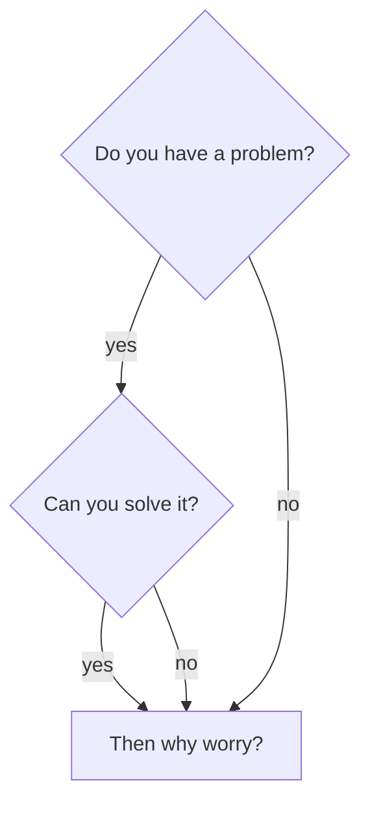

# Hi, I'm Vlad👋
 - Front-end web developer
 - Hardware enthusiast
 - Gamer
 - I ♥ TypeScript
 - I ♥ accessibility
##
```javascript
const chewbaccadev = {
    code: ["JavaScript", "TypeScript"],
    technologies: ["React", "Next"],
    biggestProjects: ["staking.humans.ai", "younichoice.com"],
    mostUsedLibraries: ["styled-components", "react-query", "zustand", "react-hook-form", "ethers.js",  "material-ui", "axios"],
    currentFocus: "Finish university",
    todo: "Become full-stack developer",
    otherSkills: ["TrueNAS", "Networking", "Hardware troubleshooting"],
    contact: {
		email: "vlad.cainamisir13@gmail.com",
		linkedin: "linkedin.com/in/vlad-cainamisir/",
		phone: "(+40) 731 194 133",
	}
};
```
##

